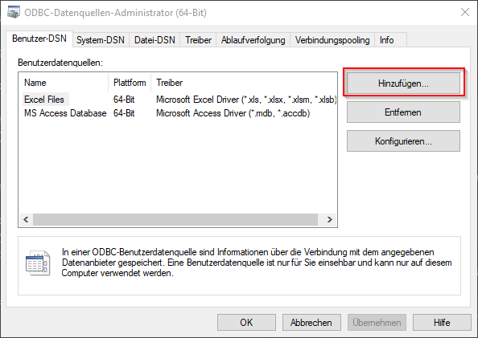
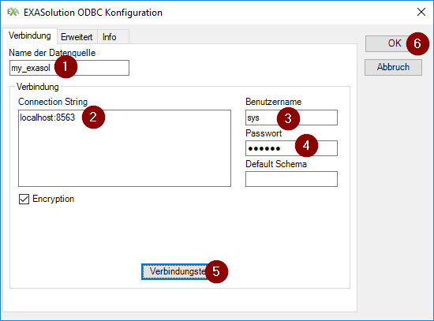

# EXASolution Python Package

[](https://travis-ci.org/EXASOL/python-exasol)

###### Please note that this is an open source project which is officially supported by EXASOL. For any question, you can contact our support team.

## Description

The EXASolution Python Package offers functionality to interact with the EXASolution
database out of Python scripts. It is developed as a wrapper around PyODBC and
extends PyODBC in two main aspects:

1. It offers fast data transfer between EXASolution and Python, multiple
   times faster than PyODBC.  This is achieved by using a proprietary
   transfer channel which is optimized for batch loading. Please read
   the Python help of exasol.readData() and exasol.writeData() for more
   details and read the documentation below.

2. It makes it convenient to run parts of your Python code in parallel on
   the EXASolution database, using EXASolution Python UDF scripts behind
   the scenes. For example you can define an Python function and execute it
   in parallel on different groups of data in an EXASolution
   table. Please read the Python help of exasol.createScript() function for
   more details and read the documentation below.


## Getting started   

### Prerequisites and Installation on Unix environment

1. Make sure you have unixODBC installed. You can download it [here](http://www.unixodbc.org/download.html)

2. Install EXASolution ODBC and configure it on your system. We recommand you to create a DSN pointing to your database instance. EXASolution ODBC can be downloaded [here](https://www.exasol.com/portal/display/DOWNLOAD/6.0).
   instance. Read the README.txt of the EXASolution ODBC driver package for details.

3. Install a recent version of the PyODBC package.
```
pip install pyodbc
```

4. Install a recent version of the Pandas package.
```
pip install pandas
```

5. Install the EXASolution Python package
Clone or download the EXASolution Python package repository. Then execute the following command:
```
python setup.py install --prefix=<path_to_python_package_installation_location>
```

6. Set environment variable and start python
```
export LD_LIBRARY_PATH=<path_to_unix_odbc_installation>/lib
export ODBCINI=<path_to_the_directory_with_odbc_ini>/odbc.ini
export ODBCSYSINI=<path_to_the_directory_with_odbc_ini>
```

7. Start python by using the EXASolution Python package which you installed in step 5
```
PYTHONPATH=<path_to_python_package_installation_location>/lib/python2.7/site-packages python
```
### Prerequisites and Installation on Windows


1. Make sure you have the Exasol ODBC driver installed. You can download it [on the Exasol website](https://www.exasol.com/portal/display/DOWNLOAD/).
On the webpage, select a main version on the left side, e.g. 6.0. Scroll down to the section `Download ODBC Driver` and download the corresponding msi, eihter x86 or x86_64. Install it on your system. Press the windows-key and type in `ODBC`. Then select ODBC-Datasources (64 Bit) or ODBC-Datasources (32 Bit), depending on the driver you just installed.

Click on `Add` and select EXASolution Driver.
Fill out the given form (see picture). Remember the name you give to your datasource


2. Install a recent version of the PyODBC package.
```
pip install pyodbc
```

3. Install a recent version of the Pandas package.
```
pip install pandas
```

4. Install the EXASolution Python package
Clone or download the EXASolution Python package repository. Navigate to the folder in your command line. Then execute the following command:
```
python setup.py install --prefix=<path_to_python_package_installation_location>
```

5. Start your python and test the connection:
```
import exasol as E
C = E.connect(dsn='my_exasol')
R = C.readData("SELECT 'connection works' FROM dual")
print(R)
```
If you get an error like this while testing, you should try the 32 Bit version of the ODBC driver instead
```
pyodbc.Error: ('IM014', u'[IM014] [Microsoft][ODBC Driver Manager]
```


### Importing the package

To use the package import it with a handy name:

```
import exasol as E
```

You can than read the documentation of this package with:
```
help(E)
```


### Connecting to EXASolution

The `E.connect` function has the same arguments, like
`pyodbc.connect`, with some additions. Please refer the PyODBC
documentation for connection parameters. To use it with EXASolution,
following arguments are possible:


Assuming you have a DSN pointing to your database instance you can connect like this:
```
C = E.connect(dsn='YourDSN')
```

Alternatively if you don't have a DSN you can also specify the required information in the connection string:
```
C = E.connect(Driver = 'libexaodbc-uo2214.so',
...               EXAHOST = 'exahost:8563',
...               EXAUID = 'sys',
...               EXAPWD = 'exasol')
```

The resulting object supports `with` statement, so the `C.close` function is called automatically on leaving the scope.


### Executing queries

The connection object has along with all PyODBC methods also a
`readData` method, which executes the query through PyODBC but
receive the resulting data faster and in different formats. Currently
supported are Pandas and CSV, but it is possible to define arbitrary
reader functions. This function will be called inside of readData
with a file descriptor as argument, where the result need to be read
as CSV.

To use this function call it with the SQL:
```
R = C.readData("SELECT * FROM MYTABLE")
print(R)
```

The result type is a Pandas data frame per default. You can use a
different callback function using the argument readCallback, for
example you can use the predefined csvReadCallback to receive the
results formatted as CSV:
```
R = C.readData("SELECT * FROM MYTABLE", readCallback = E.csvReadCallback)
print(R)
```

We also offer an explicit function to read as CSV:
```
R = C.readCSV("SELECT * FROM MYTABLE")
print(R)
```

You can also change the default return type to CSV for the whole
connection using the following argument:
```
C = E.connect(dsn="YourDSN", useCSV=True)
```


### Write data to database

With the function "C.writeData" python data can be transferred to EXASolution database. R stores the content of MYTABLE and is then transferred to a pandas dataframe. By calling the function "C.writeData" the content of MYTABLE will saved in R in form of pandas dataframe.
```
import pandas as pd

R = C.readData("SELECT * FROM MYTABLE")
df = pd.DataFrame(R)
C.writeData(R, table = 'mytable')
print(R)
```

The data will be simply appended to the given table.
Similar to readData, the default format is a pandas data frame, which
can be changed using the writeCallback parameter or the explicit version:
```
C.writeCSV(R, table = 'mytable')
```


### Using User Defined Functions

With the function decorator ``createScript`` it is possible, to
declare python functions as EXASolution UDF scripts:
```
@C.createScript(inArgs = [('a', E.INT)],
...                  outArgs = [('b', E.INT), ('c', E.INT)])
...  def testScript(data):
...      print "process data", repr(ftplib)
...      while True:
...          data.emit(data.a, data.a + 3)
...          if not data.next(): break
...      print "all data processed"
```

This script will be immediatly created on the EXASolution database as
a UDF script and the local `testScript` function will be
replaced with a `C.readData` call, so that to execute the computation
on EXASolution you call this function simply as follows:
```
testScript('columnA', table = 'testTable', groupBy = 'columnB')
```

This call executes a `SELECT` SQL query using the `C.readData` function
and returns the result. The query will group by columnB and aggregate on
the columnA column using the testScript function.

Per default, functions are created as SET EMITS UDFs. We recommend to read the
[EXASolution manual](https://www.exasol.com/portal/display/DOC/User+Manual+6.0) about UDF scripts for a better understanding.

Internally the decorated function will be compiled and serialized with
the `marshall` Python module locally and created on the EXASolution
side, so that this function has no access to the local environment
anymore. To initialize the environment, it is possible to pass the
`initFunction` argument of the decorator, which initializes the
environment on the EXASolution side. It happens every time the module
is loaded, so that this function is recreated in the database on
module loading.
